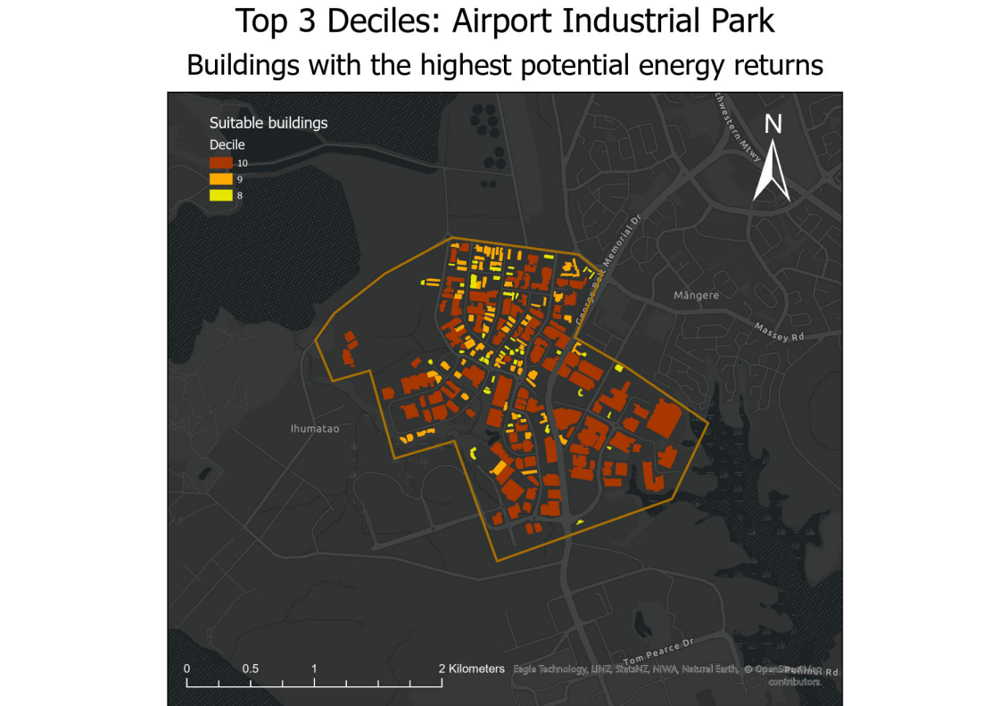

This analysis was done for the paper Applications of GIS (ENVSCI801) at Auckland Unviversity of Technology (AUT) in Semester 1 2024.
# Auckland Solar Potential Analysis
New Zealand is a country that primarily uses renewable sources most of its electricity and aims to be 100% renewable by 2030 (MBIE, 2023). Fitting solar panels to roofs on a large scale could potentially greatly support this goal. This report determines roofs areas that are valid for solar panel placement and further identifies the top 30% of buildings based on solar potential in the target areas3.

## Introduction
The target areas identified for this project are the Auckland Airport Industrial zone, Manukau, East Tāmaki, and Ōtāhuhu. Figure 1 shows the chosen priority areas along with the polygon feature class containing the footprints of the buildings taken from Land Information New Zealand (LINZ) aerial imagery in and around the areas.

The amount of solar radiation an area receives is subject to great variability through not only each day but annually and seasonally. In order to determine the amount of radiation the combined effects of direct, reflected and diffuse radiation needs to be calculated for each area and over the entire time period (ESRI, 2024). Ideal panel locations can be further narrowed down by choosing roofs that face up (low slope) and/or face north, as New Zealand is in the southern hemisphere this is the direction of most solar radiation (Khanna, 2024).

## Methodology
### Criteria and Data
The criteria used for the analysis is outlined in the first two tables below, while the datasets used is shown in the third.

| Variable | Value/Criteria |
|---|---|
| Location | Within a target region |
| Building Size | Buildings with a footprint area over 400 m2 |
| Roof Aspect | Northerly aspect between 0-50 or 310-360 degrees (inclusive) |
| Roof Angle | Roof slopes between 3-45 degrees (inclusive) |

| Variable | Value/Criteria |
|---|---|
| Input | 1m DEM pre-masked to Building footprints |
| Time | Whole year (2022) |
| Hour Interval | 1 hour |
| Calculation Directions | 16 |

| Dataset | Type | Description |
|---|---|---|
| NZ Building | Polygon Feature Class | https://data.linz.govt.nz/layer/106410-auckland-north-lidar-1m-dem-2016-2018/ |
| 1m LiDAR DEM Auckland South | .TIF Raster | https://data.linz.govt.nz/layer/104318-auckland-south-lidar-1m-dem-2016-2017/ |
| 1m LiDAR DEM Auckland North | .TIF Raster | https://data.linz.govt.nz/layer/106410-auckland-north-lidar-1m-dem-2016-2018/ |
| NZ Powerline Centrelines (1:50K) | Line Feature Class | https://data.linz.govt.nz/layer/50311-nz-powerline-centrelines-topo-150k/ |

The main geoprocessing tool used in this analysis was the Area Solar Radiation (Spatial Analyst tool). It calculates the combined total of reflected, direct, and diffuse solar radiation over a given time period (ESRI, 2024). The tool was run over the year 2022 to get the annual solar radiation each cell received in that period, however it should be noted that the LINZ LiDAR DSM used is from 2016-2017 (Auckland South) and 2016-2018 (Auckland North) so this does not account for any changes to the landscapes after the time of data collection which will affect the accuracy of the calculates annual solar radiation. Besides the Area Solar Radiation tool, primarily raster processing and data management tools were used to find suitable cells for solar panels and calculations. 

To get the average energy produced per building the mean potential annual energy (WH/m2) per building (found using Zonal Statistics) was multiplied by the building area to get the mean energy produced per building (WH).

Figure 3 shows the workflow used. It is primarily based on ESRI’s Estimate Solar Power Potential guide (Khanna, 2024). From this workflow we can calculate the average annual energy per building and the categorise the buildings into decile rankings.

## Results
### Average energy
Overall, the building average for annual solar radiation is 1243997 Wh/m2, but as there are extreme outliers the median is a better estimate at 1270047 Wh/m2 (figure below).

In the table and histogram immediately below, the average energy produced per building (Wh) is shown (the figure uses MWh for readability). Overall, the East Tāmaki area has the potential to produce the most energy with 195,440,426,185 Wh/m2 with the Airport and Manukau not far behind. However, the Airport area has a mean and median over twice the other areas (322,733,875 Wh/m2) though there are less buildings (less than a third compared to the East Tāmaki frequency) leading to a lower sum.

### Top 3 Decile
Seperating the building into 10 deciles the top 3 deciles (or top 30% of buildings) were chosen and primary targets for solar panel installation. The four figures below show these buildings for each target area.

|  |  |
|---|---|
|  |  |
|  |  |
  
The next four figures show the buildings in the top 3 deciles and the areas of the roofs that meet the criteria for solar panels.

|  |  |
|---|---|
|  |  |
|  |  |

The majority of buildings are in East Tāmaki so the majority count in each of the top 3 deciles is also East Tāmaki as shown by the pie chart and table. However, in the bar plot we see the difference between East Tāmaki and Airport & Manukau is the lowest in decile 10. This could be due to decile 10 being primarily made of large buildings which are more frequent in the Airport/Manukau area despite lower overall building counts.

|  |  |
|---|---|
|  |  |

## Discussion
Following the criteria given by Auckland Council, the best candidates for solar panel installation has been identified. East Tāmaki has the highest total potential however it spans many more roofs compared to the Airport area. The Airport area has a slightly lower total potential but less roofs, so this would be the ideal area to begin installations. Additionally, while East Tāmaki and Ōtāhuhu tend to have fewer buildings as the decile increases, the building count for the Airport area increases (Manukau stays fairly constant) further showing that the Airport is an ideal target for large roofs.

While this workflow can mostly be automated the initial georeferencing from the MAPS Priority Areas must be done manually for any new areas. Additionally, the decile ranking is done by exporting to an excel file, ranking each building by sorting by electricity produced and joining this column back to the buildings dataset. Though this part could also be automated by creating a python script to use in the model. By making the inputs to the raster tool Con, the criteria for slope and aspect can be added as parameters allowing this to be specified as well.

# Recommedations
Following the primary analysis workflow, key areas for development was identified above. The Airport area is the most ideal area to begin. From here the next step would be to use the roof pitch and orientation to simulate and maximise solar panel placement. Use of the fishnet tool and a roof slope raster would potential method.
